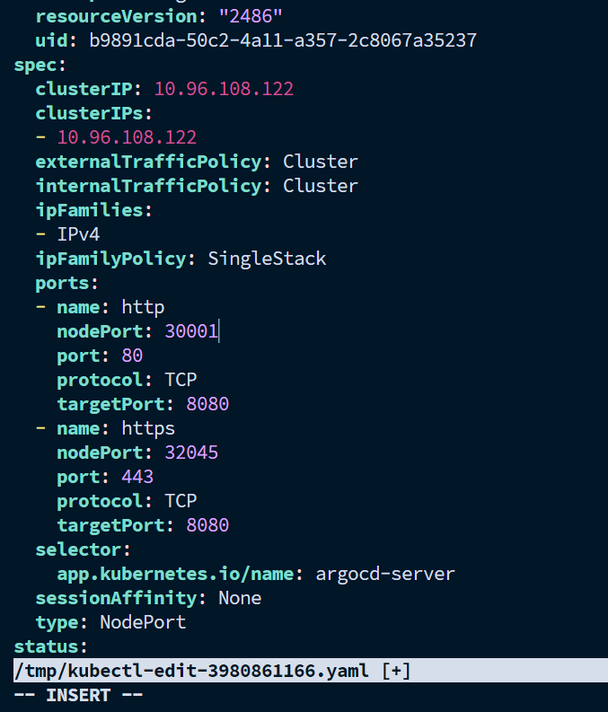
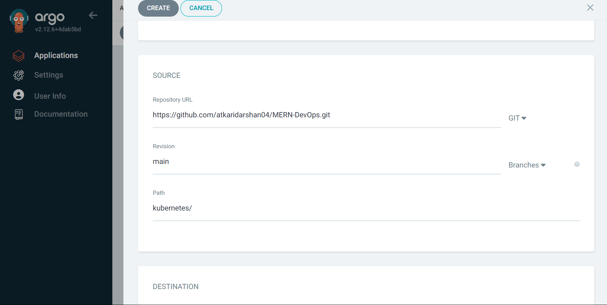
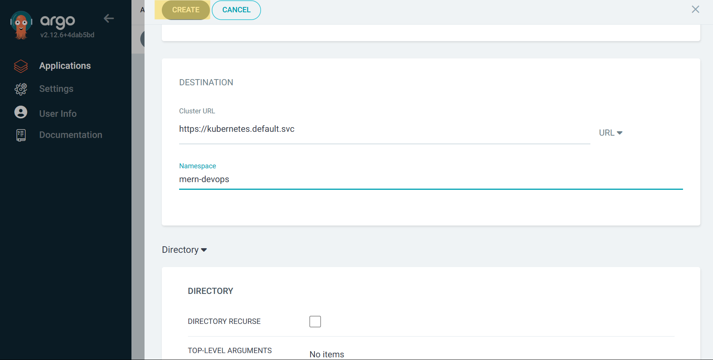
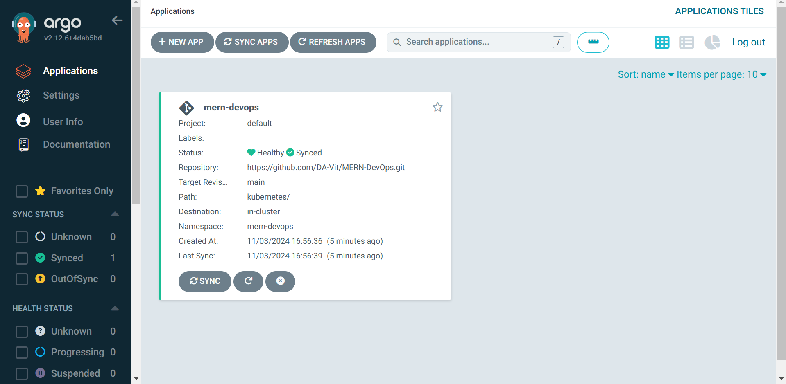
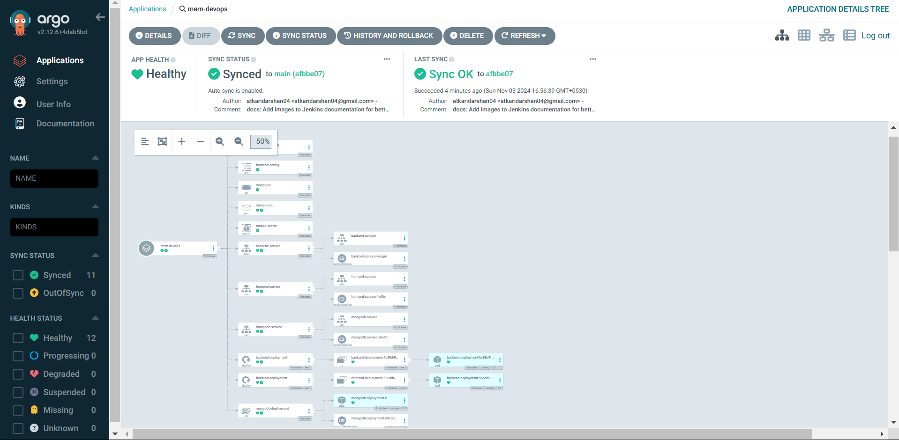

# **Deploying the MERN Application Using ArgoCD**  

This guide provides step-by-step instructions to **install and configure ArgoCD** and **deploy the MERN application** using ArgoCD linked to GitHub repository.

---

## Cluster Configuration: `kind-config.yaml`

```yaml
kind: Cluster
apiVersion: kind.x-k8s.io/v1alpha4
nodes:
- role: control-plane
  extraPortMappings:
  - containerPort: 80 # for nginx ingress
    hostPort: 80
    protocol: TCP
  - containerPort: 443
    hostPort: 443
    protocol: TCP
  - containerPort: 31000 # for frontend container 
    hostPort: 31000
    protocol: TCP
  - containerPort: 31100 # for backend container
    hostPort: 31100
    protocol: TCP
  - containerPort: 30001 # for argocd
    hostPort: 30001
    protocol: TCP
```

## **1. Install and Configure ArgoCD**

### **1 Create the ArgoCD Namespace**
```bash
kubectl create namespace argocd
```

### **2 Apply the ArgoCD Manifest**
```bash
kubectl apply -n argocd -f https://raw.githubusercontent.com/argoproj/argo-cd/stable/manifests/install.yaml
```

### **3 Verify ArgoCD Pods are Running**
```bash
watch kubectl get pods -n argocd
```
Make sure all the pods are in a **Running** state.

---

### **4 Install the ArgoCD CLI**
```bash
sudo curl --silent --location -o /usr/local/bin/argocd https://github.com/argoproj/argo-cd/releases/download/v2.4.7/argocd-linux-amd64
```

### **5 Provide Execution Permissions to the CLI**
```bash
sudo chmod +x /usr/local/bin/argocd
```
Check the version to confirm:
```bash
argocd version
```

---

### **6 Check ArgoCD Services**
```bash
kubectl get svc -n argocd
```

### **7 Change ArgoCD Server Service to NodePort**
```bash
kubectl patch svc argocd-server -n argocd -p '{"spec": {"type": "NodePort"}}'
```

Configure the nodePort `30001`
```bash
kubectl patch edit argocd-server -n argocd 
```



### **8 Confirm Service Type Change**
```bash
kubectl get svc -n argocd
```
Look for the **NodePort** under the `argocd-server` service.

---

### **9 Access the ArgoCD UI**
1. Find the NodePort assigned to the server:
   ```bash
   kubectl get svc argocd-server -n argocd
   ```
2. Access the ArgoCD UI in your browser:
   ```
   http://<public-ip-worker>:<NodePort>
   ```
   > **Note**: If you encounter a security warning, click **Advanced** and proceed.

---

### **10 Retrieve the Initial ArgoCD Admin Password**
```bash
kubectl -n argocd get secret argocd-initial-admin-secret -o jsonpath="{.data.password}" | base64 -d; echo
```
- **Username:** `admin`  
- Use the above password for the first login.

---

### **11 Update the ArgoCD Admin Password**
After logging in, go to **User Info** and change the default password for enhanced security.

---

## **2. Deploy the MERN Application Using ArgoCD**

### **1 Connect ArgoCD to the Application Repository**
1. Open the ArgoCD dashboard and click **New App**.
2. Fill in the following details:
   - **Application Name:** `mern-devops`  
   - **Project:** `default`  
   - **Sync Policy:** Choose `Manual` or `Automatic` based on your need.
   - Select `Auto-Create Namespace`

   

---

### **2 Configure Repository Details**
- **Repository URL:**  
  ```
  https://github.com/atkaridarshan04/MERN-DevOps.git
  ```
- **Revision:**  
  `main` (or any branch containing your Kubernetes manifests)  
- **Path to Manifests:**  
  `/kubernetes` 

  

---

### **3 Set Deployment Cluster and Namespace**
- **Cluster:** Select the default cluster if you are deploying to the same cluster.  
- **Namespace:** Specify a target namespace for your app: `mern-devops`

   

---

### **4 Save and Sync the Application**
1. Click **Create** to save the configuration.
2. Open the application in the ArgoCD dashboard.

   
   

---