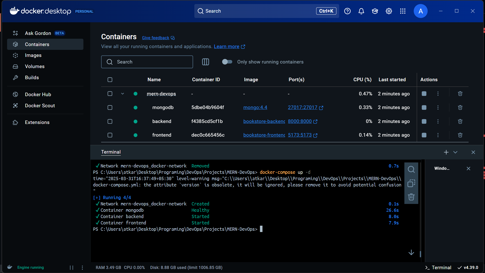
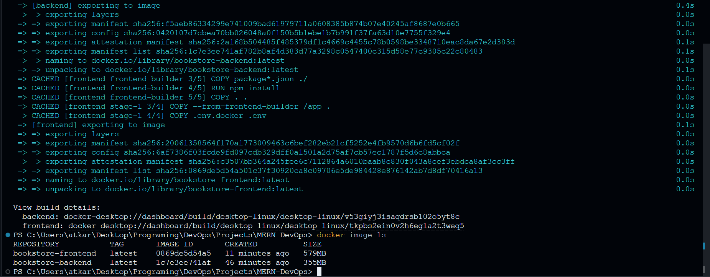
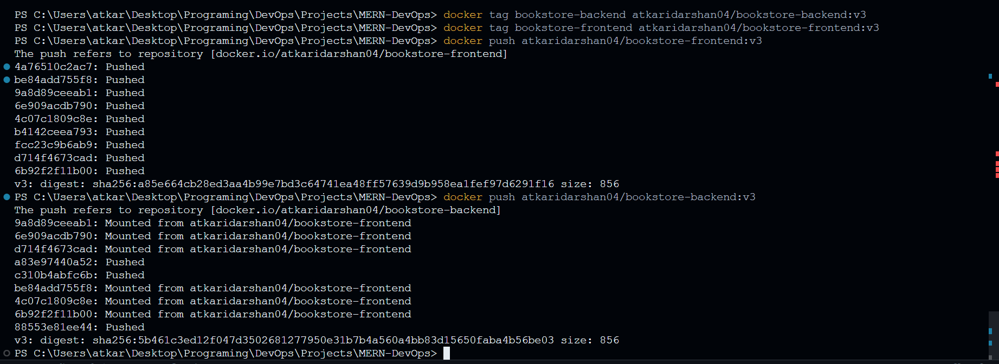
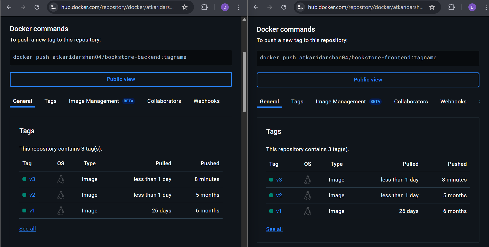

# Dockerizing a MERN Stack Application

This guide explains how to containerize and run a MERN (MongoDB, Express, React, Node.js) stack application using **Docker** and **Docker Compose**. Additionally, it covers using **Docker Bake** for images builds and pushing images to **Docker Hub**.

## Prerequisites

Ensure you have the following installed:
- [Docker](https://docs.docker.com/get-docker/)
- [Docker Compose](https://docs.docker.com/compose/install/)

## Setting Up Docker Network

Create a Docker network to allow seamless communication between containers:

```sh
docker network create docker-network
```

## Building and Running Containers Individually

### 1. Running the MongoDB Container

```sh
docker run --network=docker-network --name mongodb -d -p 27017:27017 -v ~/opt/data:/data/mydb mongo:latest
```

This starts a MongoDB container and binds the database storage to `~/opt/data` on the host machine.

### 2. Building and Running the Frontend (React)

#### Build the Frontend Docker Image

```sh
cd ./frontend
docker build -t bookstore-frontend .
```

#### Run the Frontend Container

```sh
docker run --name=frontend --network=docker-network -d -p 5173:5173 bookstore-frontend
```

#### Verify Frontend

Visit `http://localhost:5173` in your browser to check if the frontend is running.

### 3. Building and Running the Backend (Express & Node.js)

#### Build the Backend Docker Image

```sh
cd ./backend
docker build -t bookstore-backend .
```

#### Run the Backend Container

```sh
docker run --name=backend --network=docker-network -d -p 8000:8000 bookstore-backend
```

## Using Docker Compose

To simplify container management, use Docker Compose to build and run all services at once.

```sh
docker-compose up -d
```

This command will build and start the frontend, backend, and MongoDB containers as defined in `docker-compose.yml`.



## Using `docker buildx bake` for Multi-Platform Builds

To build images wecan also use the `docker buildx bake` command with a `docker-bake.hcl` or `docker-bake.yml` file.

```sh
docker buildx bake -f docker-bake.yml
```



## Pushing Docker Images to Docker Hub

To push the built images to Docker Hub, follow these steps:

1. Log in to Docker Hub:

   ```sh
   docker login
   ```

2. Tag the images:

   ```sh
   docker tag bookstore-frontend <dockerhub-username>/bookstore-frontend:v3
   docker tag bookstore-backend <dockerhub-username>/bookstore-backend:v3
   ```

3. Push the images:

   ```sh
   docker push <dockerhub-username>/bookstore-frontend:v3
   docker push <dockerhub-username>/bookstore-backend:v3
   ```

   

Go and have a look to your Docker Hub


---

### Happy Dockerizing! 🚀

