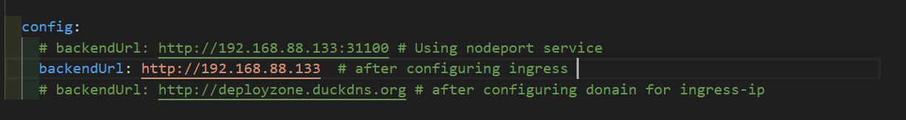

# Helm Installation and Chart Deployment Guide

## Step 1: Install Helm

Run the following command to install Helm on your machine:

```bash
curl https://raw.githubusercontent.com/helm/helm/main/scripts/get-helm-3 | bash
```

Verify the installation:

```bash
helm version
```

---

## Step 2: Package the Helm Charts

> **Note**: Modify the [values.yaml](../helm-chart/values.yaml) file as per your setup.

```bash
helm package helm-chart
```

This will create `.tgz` files for each chart in the current directory.

---

## Step 3: Install the Helm Charts

Install each chart using Helm:

```bash
helm install helm-chart ./helm-chart
```

### Verify

List all Helm releases to confirm they are deployed:

```bash
helm ls
```

Check the status of all resources in the Kubernetes cluster:

```bash
kubectl get all -n mern-devops
```

---

## Step 4: Access the Application

```bash
kubectl get svc -n mern-devops
```

```
http://<node-ip>:31000
```

---

## Step 5: Configure Ingress

Deploy the Ingress controller:

```bash
kubectl apply -f https://kind.sigs.k8s.io/examples/ingress/deploy-ingress-nginx.yaml
```

Wait for the Ingress controller pods to become ready:

```bash
kubectl wait --namespace ingress-nginx \
  --for=condition=ready pod \
  --selector=app.kubernetes.io/component=controller \
  --timeout=90s
```

Verify the Ingress controller is running:

```bash
kubectl get pods --namespace ingress-nginx
```

To configure Ingress, edit the [values.yaml](../helm-chart/values.yaml) file 


Include the following ingress configuration in `helm-chart/templates/ingress.yaml`:

```yaml
apiVersion: networking.k8s.io/v1
kind: Ingress
metadata:
  name: {{ .Release.Name }}-ingress
  namespace: {{ .Values.namespace }}
spec:
  ingressClassName: nginx
  rules:
    - http:
        paths:
          - path: /
            pathType: Prefix
            backend:
              service:
                name: {{ .Release.Name }}-frontend-service
                port:
                  number: {{ .Values.frontend.containerPort }}
          - path: /books
            pathType: Prefix
            backend:
              service:
                name: {{ .Release.Name }}-backend-service
                port:
                  number: {{ .Values.backend.containerPort }}
```

Repackage and reinstall the chart:

```bash
helm package helm-chart
helm install helm-chart ./helm-chart
```

Access the application at:

```
http://<node-ip>
```

---

## Step 6: Cleanup

If you need to uninstall the deployed Helm charts, use the following commands:

### Uninstall Chart

```bash
helm uninstall helm-chart
```

After uninstalling the charts, you can also check the status to confirm that the resources have been removed:

```bash
kubectl get ns
```

List all Helm releases to confirm they are uninstalled:

```bash
helm ls
```

---

