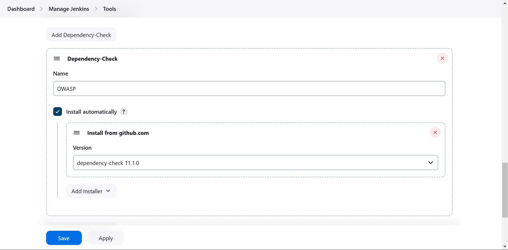
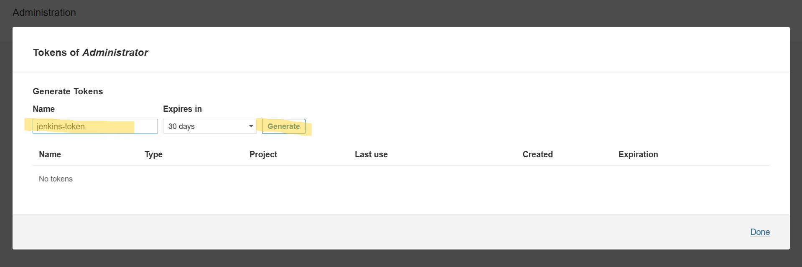
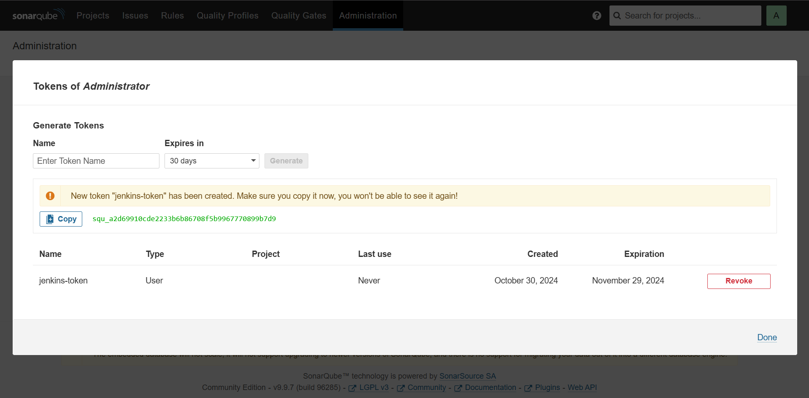
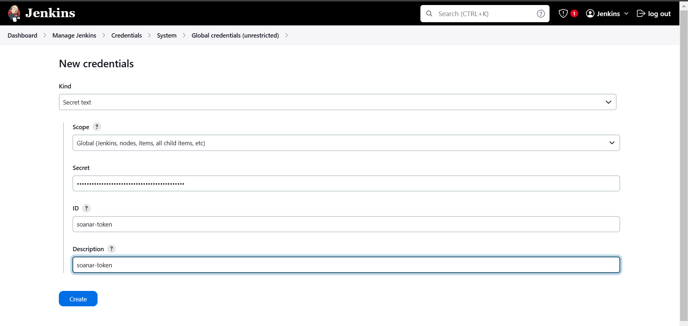
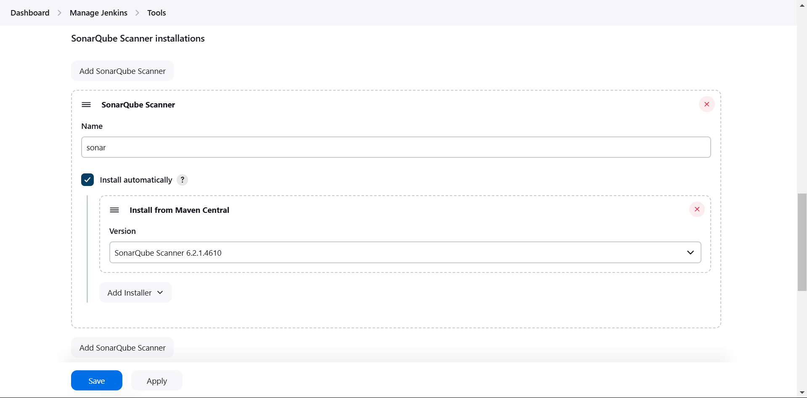
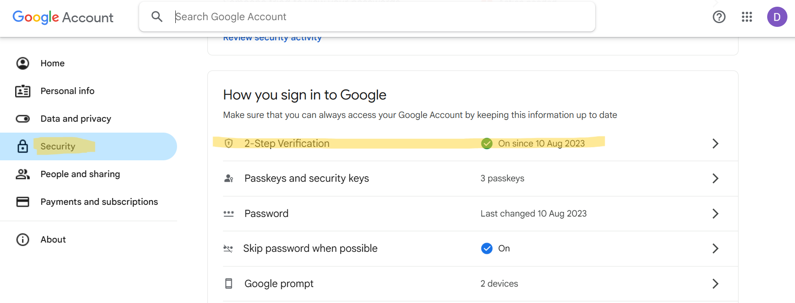
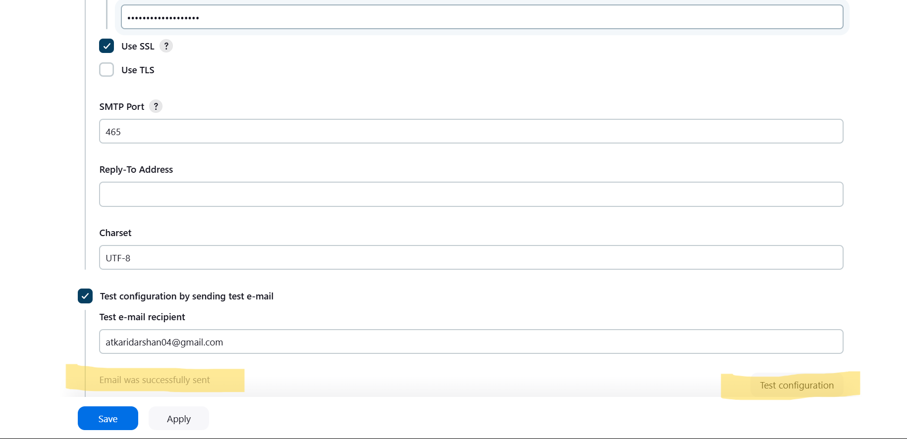
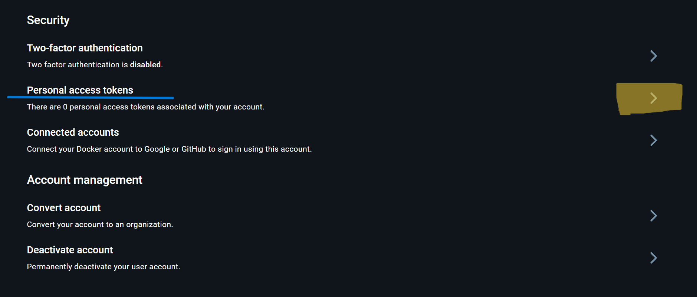
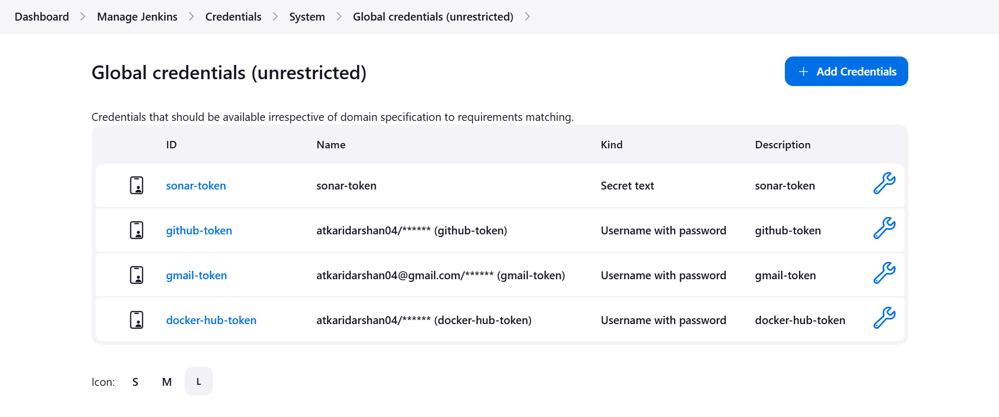

# Jenkins CI/CD Pipeline for MERN Stack Application

This guide explains the Jenkins pipeline used to automate the Continuous Integration (CI) and Continuous Deployment (CD) processes for the MERN stack application.

---

## Overview

The Jenkins pipeline is divided into two major components:

1. **Continuous Integration (CI) Pipeline**:
   - Handles code checkout from GitHub.
   - Runs security and code quality scans (Trivy, OWASP Dependency Check, SonarQube).
   - Builds Docker images for the frontend and backend applications.
   - Pushes the built Docker images to Docker Hub.

2. **Continuous Deployment (CD) Pipeline**:
   - Updates Kubernetes manifest files with the new Docker image tags.
   - Pushes the updated configurations back to GitHub.
   - Notifies the team via email about the build and deployment status.

---


# Tool Installation Guide

| Tech stack                    | Installation                                                       |
|-------------------------------|--------------------------------------------------------------------|
| Jenkins                | <a href="#jenkins">Install and configure Jenkins</a>              |
| OWASP setup                   | <a href="#owasp">Install and configure OWASP</a>                   |
| SonarQube                     | <a href="#sonarqube">Install and configure SonarQube</a>               |
| Trivy                         | <a href="#trivy">Install Trivy</a>                           |
| Email Notification Setup       | <a href="#email-notifications">Email notification setup</a>               |
| GitHub & Docker Hub Credentials | <a href="#credentials">Add GitHub and Docker Hub Credentials</a> |


---

## 1. **Install and Configure Jenkins** <b id="jenkins"></b>

1. **Install Jenkins:**
     ```bash
     sudo apt update -y
     sudo apt install openjdk-17-jre -y
     sudo wget -O /usr/share/keyrings/jenkins-keyring.asc https://pkg.jenkins.io/debian-stable/jenkins.io-2023.key
     echo "deb [signed-by=/usr/share/keyrings/jenkins-keyring.asc] https://pkg.jenkins.io/debian-stable binary/" | sudo tee /etc/apt/sources.list.d/jenkins.list
     sudo apt-get update -y
     sudo apt-get install jenkins -y
     ```
   - Access Jenkins at `http://<your-ec2-public-ip>:8080`, then follow the setup wizard (initial admin password located at `/var/lib/jenkins/secrets/initialAdminPassword`).

2. **Install Required Plugins (via GUI):**
   - Navigate to **Manage Jenkins > Manage Plugins > Available Plugins** and install:
     - OWASP Dependency-Check
     - SonarQube Scanner
     - Docker Pipeline
     - Pipeline Stage View
   
   

---

## 2. **Configure OWASP in Jenkins** <b id="owasp"></b>

1. **Install OWASP Plugin:**
   - In Jenkins, go to **Manage Jenkins > Manage Plugins**.
   - In the **Available Plugins** tab, search for **OWASP Dependency-Check** and install it.

2. **Configure OWASP Dependency-Check:**
   - Go to **Manage Jenkins > Tool**.
   - Scroll to **Add Dependency-Check** 
      - Name it `OWASP`
      - Click on **Install Automatically**
         - Click on **Add installer** -> **Install from github.com**

   

---

## 3. **Install and Configure SonarQube** <b id="sonarqube"></b>

1. **Run SonarQube as a Docker Container:**
   - Run SonarQube on your server or a dedicated instance:
     ```bash
     docker run -d --name sonarqube -p 9000:9000 sonarqube:lts-community
     ```
   - Access SonarQube at `http://<your-server-ip>:9000`.

2. **SonarQube Initial Configuration:**
   - Set up an admin account and create a new token for Jenkins.
     - **Navigate to:** `Administration > Security > Users > Tokens`.
     - **Create a token** and give it a name, e.g., `jenkins-token`.

   
   
   

3. **Integrate SonarQube with Jenkins:**
   - In Jenkins, go to **Manage Jenkins > Configure System**.
   - Scroll to **SonarQube Servers** and add a new server with the following details:
     - **Name:** `sonar`
     - **Server URL:** `http://<your-server-ip>:9000`.
     - **Authentication Token:** Click **Add** to add the token.
       - Set **Kind** to **Secret text**.
       - Paste the **SonarQube token** generated earlier.
       - Give it a unique **ID** like `sonar-token`.       
       
   
   

   - Click **Save** to apply the changes.

4. **Add SonarQube Scanner to Jenkins:**
   - Go to **Manage Jenkins > Tool**.
   - Scroll to **SonarQube Scanner installations** and install the latest version of the SonarQube Scanner.
   - Name it `sonar`.

   
---

## 4. **Configure SonarQube Webhook** 

1. **Set Up Webhook in SonarQube:**
   - Go to **SonarQube > Administration > Configuration > Webhooks**.

   

   - Add a new webhook with the following details:
     - **URL:** `http://<your-jenkins-url>/sonarqube-webhook/`
   - This allows SonarQube to send analysis results back to Jenkins.

   

---

## 5. **Install Trivy for Security Scanning** <b id="trivy"></b>

**Install Trivy:** Run the following commands in terminal where Jenkins is installed.
   ```bash
   sudo apt-get install wget apt-transport-https gnupg lsb-release -y
   wget -qO - https://aquasecurity.github.io/trivy-repo/deb/public.key | sudo apt-key add -
   echo deb https://aquasecurity.github.io/trivy-repo/deb $(lsb_release -sc) main | sudo tee -a /etc/apt/sources.list.d/trivy.list
   sudo apt-get update -y
   sudo apt-get install trivy -y
   ```

---

## 6. **Email Notification Setup in Jenkins** <b id="email-notifications"></b>

1. **Create Gmail App Password:**
   - Go to your Google Account and generate an **App Password** under **Security** > **App Passwords** (requires two-factor authentication).

   
   
   

2. **Setup Up Credentials in Jenkins:**  
   Paste the `Secret` at the password.
   


3. **Setup Email Notifications:**
   - Go to **Manage Jenkins > Configure System**.
   - Scroll to **Extended E-mail Notification** and configure:
     - **SMTP server:** `smtp.gmail.com`
     - **SMTP port:** `465`
     - **Use SSL:** `Yes`

      

   - Scroll to **E-mail Notification** and configure
     - **SMTP authentication username:** Your Gmail address
     - **SMTP authentication password:** App-specific password (generated via Gmail with two-factor authentication).

      
      

---

## 7. **Add GitHub and Docker Hub Credentials to Jenkins** <b id="credentials"></b>

### **Add GitHub Credentials**

1. **Generate a GitHub Personal Access Token:**
   - Go to **GitHub** > **Settings** > **Developer settings** > **Personal access tokens**.
   - Generate a new token with necessary permissions (e.g., `repo`, `admin:repo_hook` for repository access).
   

2. **Add GitHub Credentials in Jenkins:**
   - In Jenkins, go to **Manage Jenkins > Manage Credentials**.
   - Under the appropriate domain (usually the **Global** domain):
     - Click **Add Credentials**.
     - Select **Kind:** `Username and Password`.
     - In the **Username** field, paste your **GitHub Username**.
     - In the **Secret** field, paste your **GitHub personal access token**.
     - **ID:** Give it a descriptive ID, such as `github-token`.
     - **Description:** Something like "GitHub Token for Jenkins".

     

---

### **Add Docker Hub Credentials**

1. **Generate a Docker Hub Personal Access Token:**
   - Go to **Docker Hub** > **Account Settings** > **Personal Access Token** 

      
      

2. **Add Docker Hub Credentials in Jenkins:**  
   - Follow same as done for GitHub Credentials  

---

## 8. All Credentials
   

---

## Key Stages in the CI Pipeline

### 1. **Workspace Cleanup**
   - Ensures that the workspace is clean before starting the build process.

### 2. **Code Checkout**
   - Retrieves the latest code from the GitHub repository.

### 3. **Security and Quality Scanning**
   - **Trivy**: Scans the project files for vulnerabilities.
   - **OWASP Dependency Check**: Analyzes project dependencies for known security issues.
   - **SonarQube**: Performs static code analysis to detect bugs, code smells, and vulnerabilities.

### 4. **Docker Image Build**
   - Builds Docker images for both the frontend and backend of the MERN application.
   - The built images are tagged with a version, making them easy to identify and manage.

### 5. **Push Docker Images to Docker Hub**
   - Tags the images using parameters (`FRONTEND_DOCKER_TAG` and `BACKEND_DOCKER_TAG`).
   - Pushes the tagged images to Docker Hub for future deployments.

---

## Key Stages in the CD Pipeline

### 1. **Verify Docker Image Tags**
   - Confirms that the correct Docker image tags for the frontend and backend have been provided.

### 2. **Update Kubernetes Manifests**
   - Updates the Kubernetes YAML files with the new Docker image tags for both the backend and frontend services.

### 3. **Git Push**
   - Commits the updated Kubernetes manifest files to the GitHub repository.

### 4. **Email Notification**
   - Sends a formatted email with the build and deployment status to the team, including links to the Jenkins build.

---

## Pipeline Parameters

The pipeline requires the following parameters:

- **`FRONTEND_DOCKER_TAG`**: The tag for the frontend Docker image that will be built and pushed to Docker Hub.
- **`BACKEND_DOCKER_TAG`**: The tag for the backend Docker image that will be built and pushed to Docker Hub.

### Usage of Parameters
- These parameters should be specified when triggering the pipeline to ensure the correct versions of the images are built and deployed.


---

## Usage

1. **CI Pipeline**: Triggers automatically when code is pushed to the repository, running tests, security scans, building Docker images, and pushing them to Docker Hub.
   
2. **CD Pipeline**: Triggers after successful CI execution. It updates the Kubernetes manifests with the new Docker image tags, pushes the changes to GitHub, and applies the new configurations to the Kubernetes cluster.

---

By following this process, the CI/CD pipeline ensures the MERN stack application is continuously integrated and deployed, automating testing, security scanning, containerization, and deployment.

---