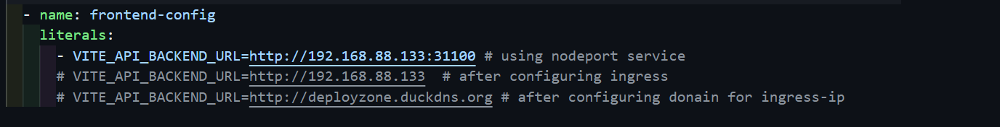
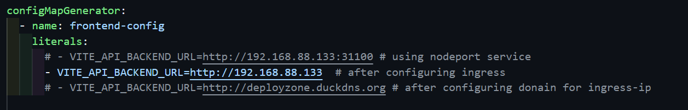
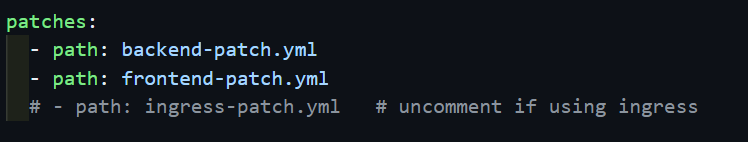

# Managing Kubernetes Deployments with Kustomize

## Overview
Kustomize simplifies Kubernetes configurations by allowing environment-specific customizations without modifying the base YAML files. It provides a structured approach to managing multiple environments, such as Development and Production, by dynamically applying changes.

## Environment Stages
We have configured the following environments:

- **Development (`overlays/dev`)**
- **Production (`overlays/prod`)**

### Key Differences Between Environments
Each environment applies specific patches to modify:

1. **Replica Count**
   - Development: `replicas: 1`
   - Production: `replicas: 2`

2. **Container Image Versions**
   - Different images are used for each environment.

## Configuration Management
Instead of separate YAML files, we use `configMapGenerator` and `secretGenerator` in Kustomize to manage ConfigMaps and Secrets. Ensure these configurations are correctly set up in the [/base/kustomization.yml](../kustomize/base/kustomization.yml)



## Deployment Process

### 1. Set Up the Namespace
Before deploying, create the required namespace and set the context:

```bash
kubectl create namespace mern-devops
kubectl config set-context --current --namespace=mern-devops
```

### 2. Verify Configuration
Before applying the deployment, verify the configurations:

```bash
kubectl kustomize overlays/dev   # Verify Development environment
kubectl kustomize overlays/prod  # Verify Production environment
```

### 3. Deploy the Application

#### Deploy to Development Environment
```bash
kubectl apply -k overlays/dev
```

#### Deploy to Production Environment
```bash
kubectl apply -k overlays/prod
```

**Note:** If deploying both environments within the same cluster, ensure that node ports for frontend and backend deployments do not conflict.

## Post-Deployment Verification

### Check Applied Configurations
```bash
kubectl get configmap backend-config -o yaml -n mern-devops
```

### Check Running Pods
```bash
kubectl get pods -n mern-devops
```

### Verify Service Endpoints
```bash
kubectl get svc -n mern-devops
```

### Access the Application
Once deployed, access the frontend using:

```bash
http://<NODE_IP>:31000
```

To find the **Node IP**, run:

```bash
kubectl get nodes -o wide
```

## Configuring Ingress (Optional)

### 1. Install Nginx Ingress Controller
Deploy the Ingress controller:

```bash
kubectl apply -f https://kind.sigs.k8s.io/examples/ingress/deploy-ingress-nginx.yaml
```

Verify the Ingress controller is running:

```bash
kubectl get pods --namespace ingress-nginx
```

### 2. Update Ingress Configuration
Ensure the necessary configurations are updated in the following files:

- [base/kustomization.yml](../kustomize/base/kustomization.yml)
   

- [overlays/dev/kustomization.yml](../kustomize/overlays/dev/kustomization.yml)
- [overlays/prod/kustomization.yml](../kustomize/overlays/prod/kustomization.yml)
   


### 3. Access the Application via Ingress
Once deployed, the application can be accessed at:

```bash
http://<NODE_IP>/
```

## Deleting Resources
To remove all resources for a specific environment:

```bash
kubectl delete -k overlays/dev   # Delete Development environment
kubectl delete -k overlays/prod  # Delete Production environment
```

Alternatively, delete the entire namespace:

```bash
kubectl delete namespace mern-devops
```

## Additional Useful Commands

### View Logs
```bash
kubectl logs -l app=backend -n mern-devops
kubectl logs -l app=frontend -n mern-devops
```

### Restart Deployments
```bash
kubectl rollout restart deployment dev-backend-deployment -n mern-devops
kubectl rollout restart deployment dev-frontend-deployment -n mern-devops
```

## Conclusion
- **Kustomize provides an efficient way to manage multiple Kubernetes environments.**
- **Environment-specific patches ensure flexibility without modifying base YAML files.**
- **ConfigMaps and Secrets are dynamically generated through Kustomize.**
- **Namespace must be created before deployment.**
- **Easily deploy, verify, and access your MERN application using Kustomize.**

---