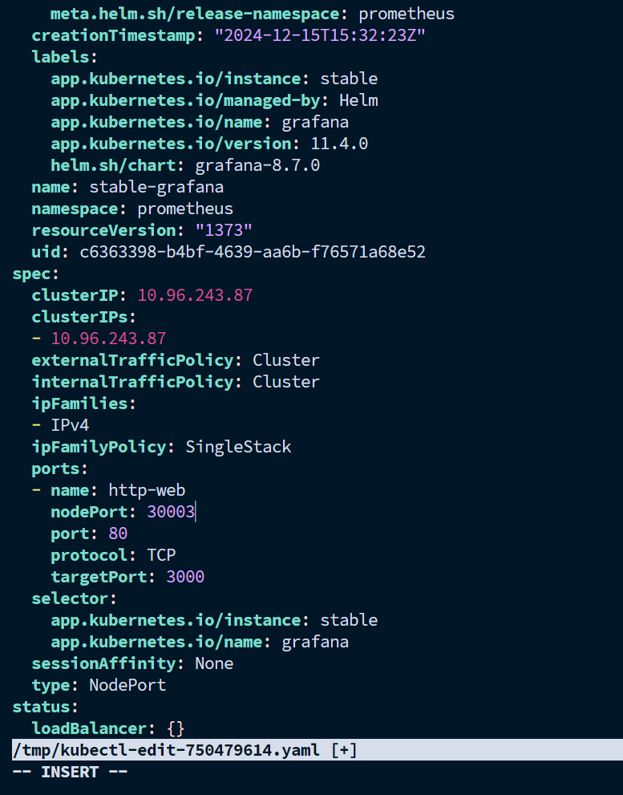
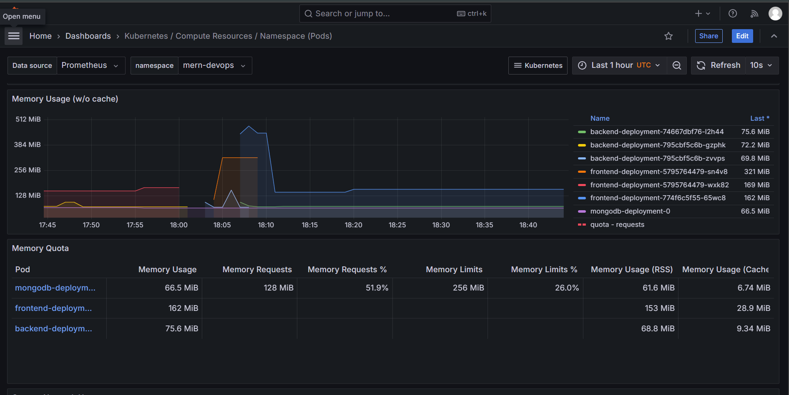

# Setting up Observability 

### Create Cluster: `kind-config.yaml`
```yaml
kind: Cluster
apiVersion: kind.x-k8s.io/v1alpha4
nodes:
- role: control-plane
  extraPortMappings:
  - containerPort: 80 # for nginx ingress
    hostPort: 80
    protocol: TCP
  - containerPort: 443
    hostPort: 443
    protocol: TCP
  - containerPort: 31000 # for frontend container 
    hostPort: 31000
    protocol: TCP
  - containerPort: 31100 # for backend container
    hostPort: 31100
    protocol: TCP
  - containerPort: 30001 # for argocd
    hostPort: 30001
    protocol: TCP
  - containerPort: 30002 # for prometheus
    hostPort: 30002
    protocol: TCP
  - containerPort: 30003 # for graphana
    hostPort: 30003
    protocol: TCP
```

```bash
kind create cluster --config kind-config.yaml
```

---

## Steps to Install and Configure Prometheus and Grafana  

### 1. **Install Helm on the Master Machine**  
```bash
curl -fsSL -o get_helm.sh https://raw.githubusercontent.com/helm/helm/main/scripts/get-helm-3
chmod 700 get_helm.sh
./get_helm.sh
```

### 2. **Add Helm Repositories**  
Add the necessary Helm repositories for stable charts and Prometheus charts:  
```bash
helm repo add stable https://charts.helm.sh/stable
helm repo add prometheus-community https://prometheus-community.github.io/helm-charts
helm repo update
```

### 3. **Create a Namespace for Prometheus**  
Organize resources by creating a namespace:  
```bash
kubectl create namespace prometheus
kubectl get ns
```

### 4. **Install Prometheus and Grafana Using Helm**  
Deploy the `kube-prometheus-stack` Helm chart:  
```bash
helm install prometheus prometheus-community/kube-prometheus-stack -n prometheus
```

### 5. **Verify the Installation**  
Check if the Prometheus components are deployed:  
```bash
kubectl get pods -n prometheus
```

### 6. **Expose Prometheus and Grafana Services**  
By default, services are set to `ClusterIP`. To make them accessible externally, change the type to `NodePort` or configure an ingress:  

- **Edit Prometheus Service**:  
  ```bash
  kubectl edit svc prometheus-kube-prometheus-prometheus -n prometheus
  ```  
  Update `type: ClusterIP` to `type: NodePort` and save the file.  
  

- **Edit Grafana Service**:  
  ```bash
  kubectl edit svc prometheus-grafana -n prometheus
  ```  
  Similarly, update `type: ClusterIP` to `type: NodePort`. 
  

### 7. **Verify Exposed Services**  
Check the services to get the assigned NodePorts:  
```bash
kubectl get svc -n prometheus
```

### 8. **Access Grafana Dashboard and Prometheus**  
Retrieve the Grafana admin password and access the dashboard:  
```bash
kubectl get secret --namespace prometheus prometheus-grafana -o jsonpath="{.data.admin-password}" | base64 --decode
echo
```

- **Grafana URL**: Access using `<NodeIP>:30003` in your browser.  
  - Username: `admin`  
  - Password: *(as retrieved above)*  
- **Prometheus Url**: Access using `<NodeIP>:30002` in browser

---

### 9. **Set Up Monitoring Dashboards**  
1. **Add Prometheus as Data Source**:  
   - Navigate to **Configuration > Data Sources** in Grafana.  
   - Add Prometheus as the data source.  

2. **Import Predefined Dashboards**:  
   - Visit [Grafana Dashboards](https://grafana.com/grafana/dashboards/) to download Kubernetes-specific dashboards, such as Node Exporter or Kube-State-Metrics.  
   - Import the JSON files into Grafana under **Dashboards > Import**.  

3. **Set Up Alerts**:  
   - Configure alerts in Prometheus for key metrics like CPU usage, memory consumption, or pod availability.  
   - Use Grafana to set up alerting rules and visualize trends.  
---



---